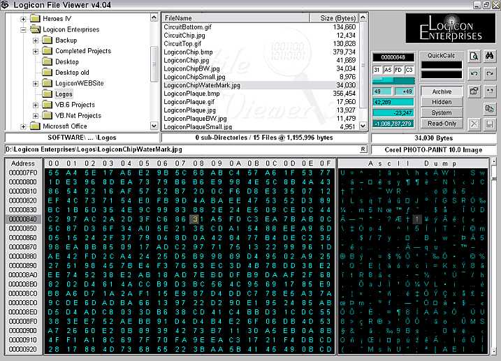



## Logicon File Viewer 4\.05 \(Release 2\)

### Description

This is a RAW hex/ascii file viewer/editor. Use with caution - don't edit important or sys files unless you know what you're doing!!! (modRegistry has been added - sorry for inconv.)

Great tool for tweaking (cheating) an RPG save file.
 
### More Info
 
Backup files you wish to modify first. Don't modify important or system files unless you know what you are doing first!!!

             |
---                |---
**Submitted On**   |2003-07-23 15:51:24
**By**             |[Tim Harpur](https://github.com/Planet-Source-Code/PSCIndex/blob/master/ByAuthor/tim-harpur.md)
**Level**          |Intermediate
**User Rating**    |5.0 (50 globes from 10 users)
**Compatibility**  |VB 5\.0, VB 6\.0
**Category**       |[Complete Applications](https://github.com/Planet-Source-Code/PSCIndex/blob/master/ByCategory/complete-applications__1-27.md)
**World**          |[Visual Basic](https://github.com/Planet-Source-Code/PSCIndex/blob/master/ByWorld/visual-basic.md)
**Archive File**   |[Logicon\_Fi1619487242003\.zip](https://github.com/Planet-Source-Code/tim-harpur-logicon-file-viewer-4-05-release-2__1-47105/archive/master.zip)

